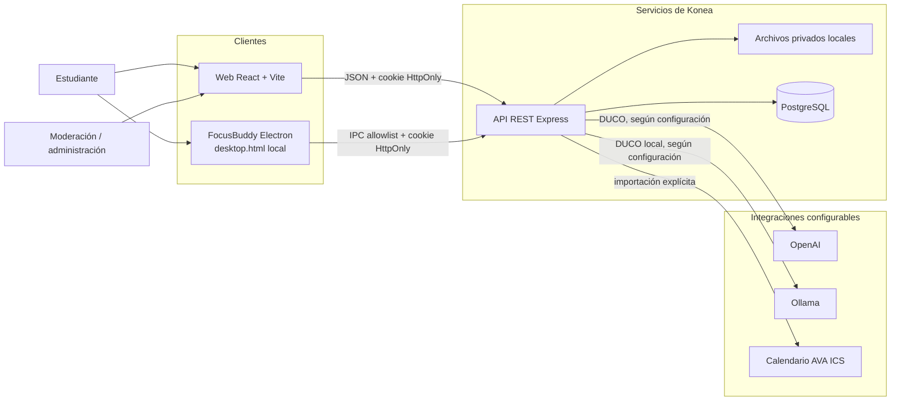
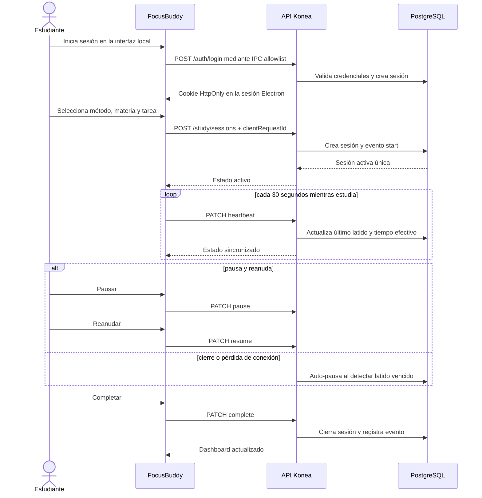
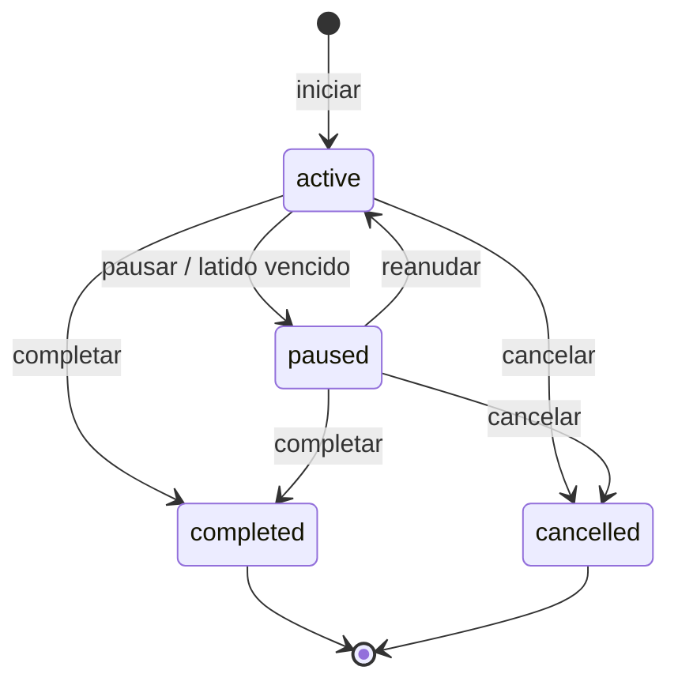
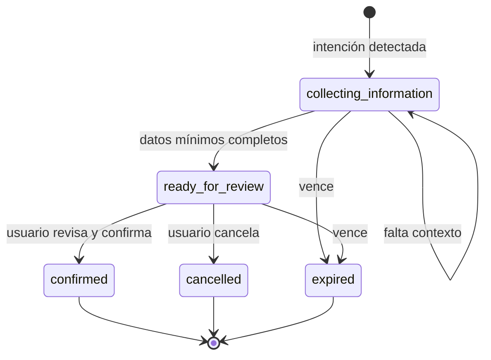
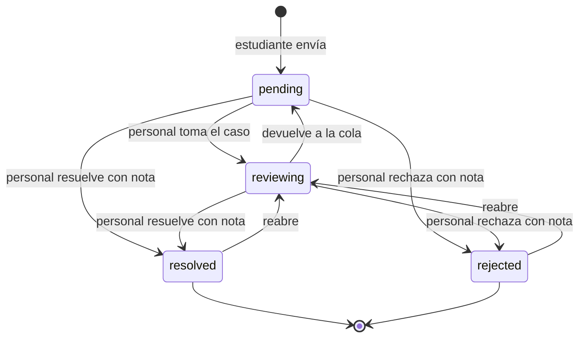

# Diagramas técnicos de Konea Rebirth

Estos diagramas resumen el incremento Capstone implementado. La definición
detallada de rutas y reglas se mantiene en [api.md](./api.md), y las decisiones
de diseño en [architecture.md](./architecture.md).

## Diagrama de componentes

El cliente Electron no carga la SPA: incorpora una interfaz local con login,
estudio, progreso, ajustes y cuenta. Solo el proceso principal llama a una lista
cerrada de rutas de la API y conserva la cookie en su sesión persistente. Por
ello una sesión iniciada en escritorio aparece en el dashboard web y mantiene
una sola fuente de verdad en PostgreSQL.

## Modelo entidad-relación resumido

El esquema real contiene 31 tablas. Este diagrama muestra las relaciones que
explican los flujos centrales sin convertir la vista en una lista ilegible.

```mermaid
erDiagram
  USERS ||--|| PROFILES : posee
  USERS ||--o{ USER_SESSIONS : inicia
  USERS ||--o{ UPLOADED_FILES : sube

  USERS ||--o{ POSTS : publica
  USERS ||--o{ COMMENTS : escribe
  POSTS ||--o{ COMMENTS : recibe
  USERS ||--o{ POST_LIKES : marca
  POSTS ||--o{ POST_LIKES : recibe
  USERS ||--o{ CONNECTION_INTENTS : solicita
  USERS ||--o{ CONNECTIONS : integra

  CHATS ||--o{ CHAT_PARTICIPANTS : contiene
  USERS ||--o{ CHAT_PARTICIPANTS : participa
  CHATS ||--o{ MESSAGES : contiene
  USERS ||--o{ MESSAGES : envía
  MESSAGES ||--o{ MESSAGE_RECEIPTS : confirma
  USERS ||--o{ MESSAGE_RECEIPTS : recibe
  USERS ||--o{ CHAT_READS : registra
  MESSAGES ||--o| POLLS : adjunta
  POLLS ||--o{ POLL_OPTIONS : ofrece
  POLL_OPTIONS ||--o{ POLL_VOTES : recibe

  USERS ||--o{ ACADEMIC_COURSES : organiza
  USERS ||--o{ ACADEMIC_TASKS : crea
  ACADEMIC_COURSES ||--o{ ACADEMIC_TASKS : agrupa
  USERS ||--o{ ACADEMIC_CALENDAR_SYNCS : sincroniza
  USERS ||--o{ ACADEMIC_CALENDAR_EVENTS : importa

  USERS ||--o{ STUDY_SESSIONS : realiza
  ACADEMIC_COURSES o|--o{ STUDY_SESSIONS : contextualiza
  ACADEMIC_TASKS o|--o{ STUDY_SESSIONS : contextualiza
  STUDY_SESSIONS ||--o{ STUDY_SESSION_EVENTS : audita

  USERS ||--o{ ASSISTANT_MESSAGES : conversa
  USERS ||--o{ DUCO_DRAFTS : revisa
  ASSISTANT_MESSAGES o|--o| DUCO_DRAFTS : origina
  ASSISTANT_MESSAGES o|--o| SUPPORT_REQUESTS : origina
  SUPPORT_REQUESTS ||--o{ SUPPORT_REQUEST_EVENTS : mantiene

  USERS ||--o{ NOTIFICATIONS : recibe
  USERS ||--o{ REPORTS : reporta
```

`duco_drafts.completed_resource_id` enlaza conceptualmente el borrador con la
tarea o solicitud confirmada. No se dibuja como clave foránea porque el destino
depende de `kind` y, por tanto, puede pertenecer a dos tablas distintas.

## Secuencia de una sesión FocusBuddy

## Estados auditables

### Sesión de estudio

### Borrador preparado por DUCO

### Solicitud de soporte

Cada cambio de soporte se agrega a `support_request_events`; el historial no se
reescribe al responder o cambiar de estado.
